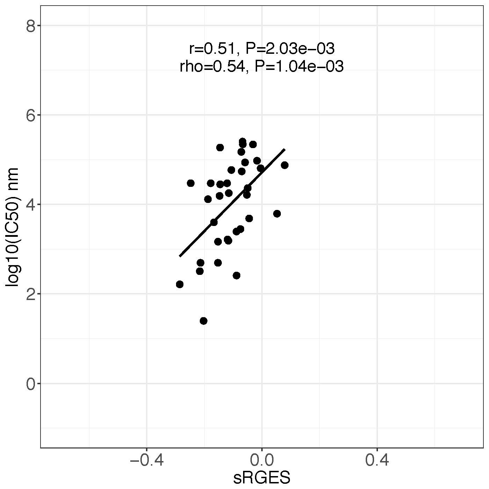
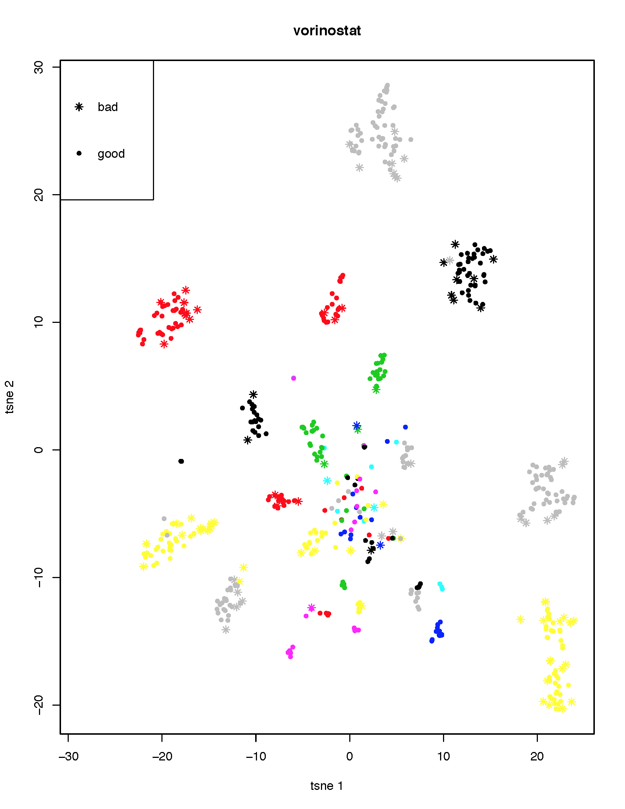

# method 1
check if the corrected samples lead to a better correlation between drug-efficacy and RGES
assume if GAN can generate better samples, the correlation should increase. Using uncorrected samples, the correlation is ~0.47

```sh
Rscript evaluate_gan.R ~/proj/deepdrug/data ~/chenlab_v1/denoise_gan/2017-07-27-17-04-15_baseline/ 10000
```

## Method 1
base line correlation (raw bad samples without correction)


correlation from one model


# method 2
We have a few hundred identical samples shared by good and bad samples. Identical means they were treated under the same
biological conditions. There profiles should be similar. If GAN is good, it should increase the similarity between two identical samples
```sh
 Rscript gan_pred_analysis.R ~/proj/deepdrug/data ~/chenlab_v1/denoise_gan/2017-07-28-02-04-49_baseline/ 40000
```

correlation between bad samples and good samples for drug vorinostat. The samples are colored by their biological conditions. Looks like the bad samples are on the surface of each cluster.



